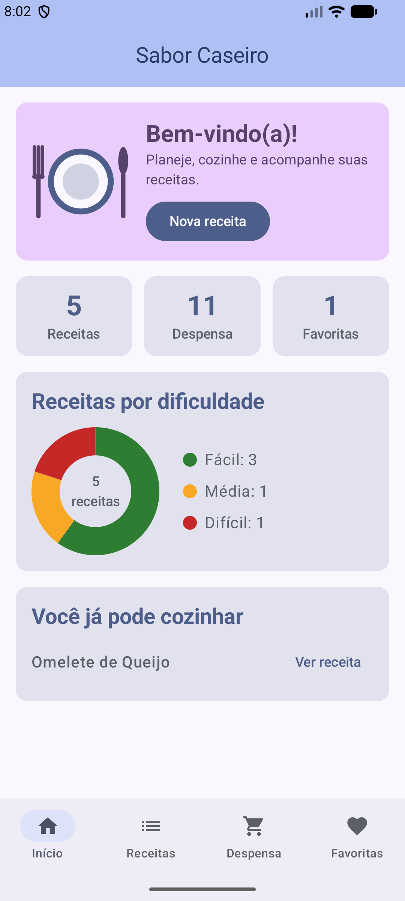
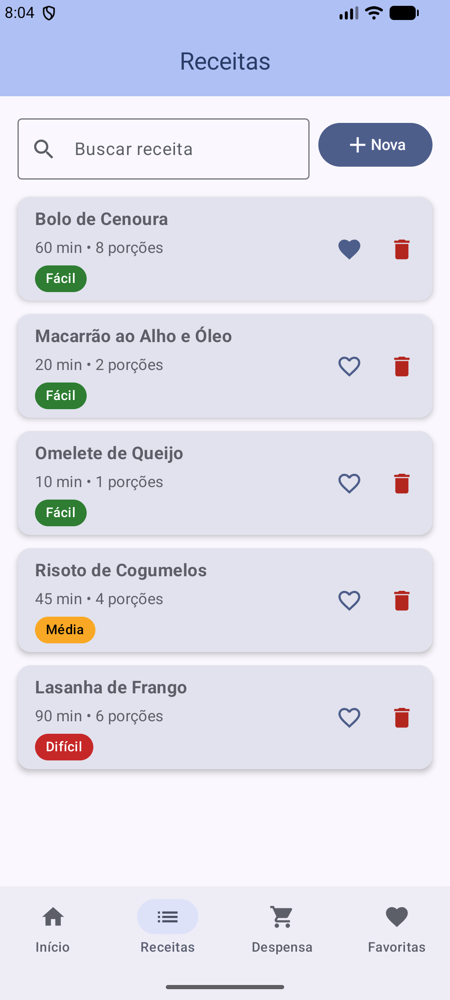
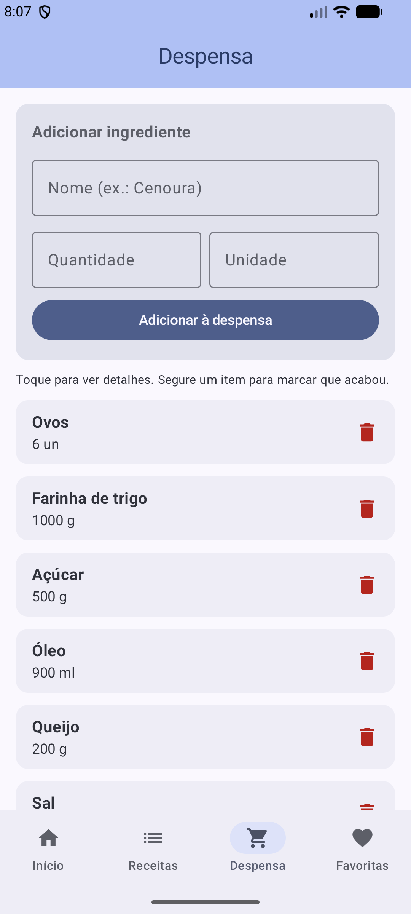
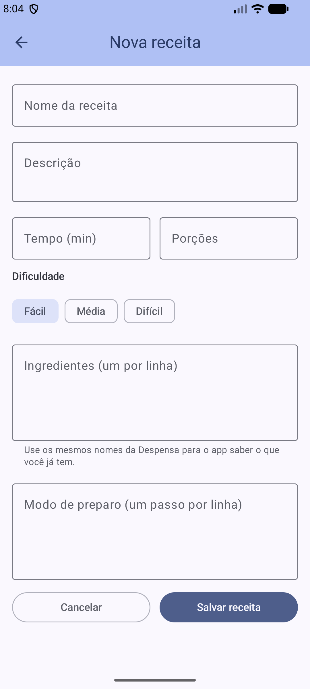
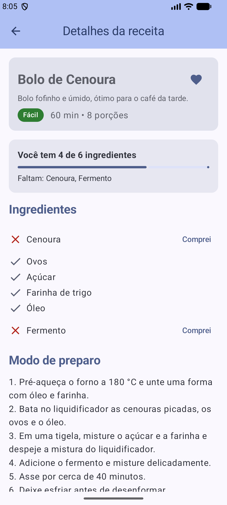
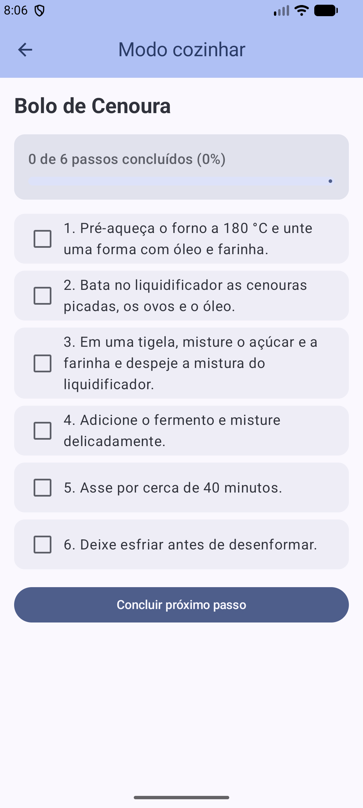
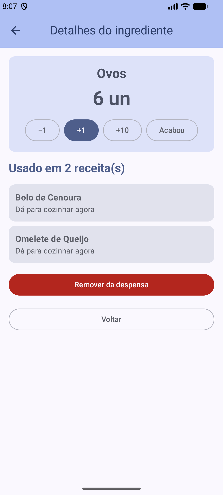
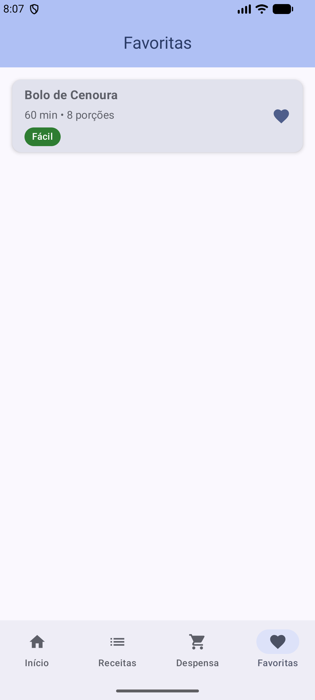
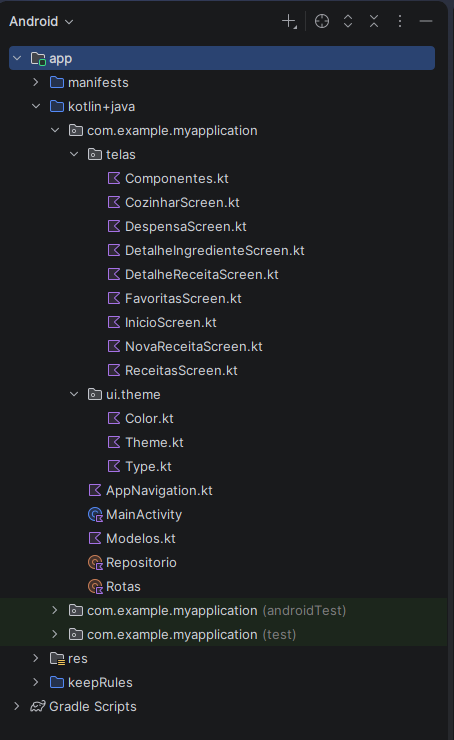
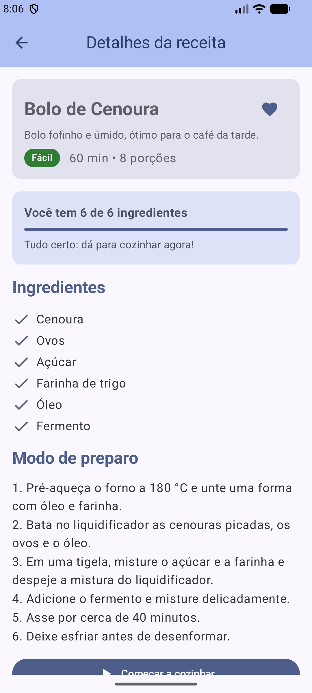

[README.md](https://github.com/user-attachments/files/33222844/README.md)[Uploading R# Sabor Caseiro — app de culinária (Jetpack Compose)

Trabalho 2 — MAF (Mínimo Aplicativo Funcional) da disciplina Desenvolvimento de Aplicativos Móveis (Kotlin + Jetpack Compose).

**Aluno:** Juliano Ferrari Do Prado

## Transparência: como o Claude foi usado

Usei o Claude (assistente de IA da Anthropic) para acelerar o desenvolvimento por causa do prazo: ele escreveu o código-base do app a partir do enunciado e dos conteúdos das aulas, já com comentários explicando os conceitos. O trabalho **não** foi feito 100% pela IA. A minha parte:

- escolhi o tema (app de culinária) e as duas listas (receitas e ingredientes);
- configurei o projeto no Android Studio, adicionei as dependências e resolvi os erros de build (veja "Dificuldades");
- instalei o Git e publiquei o projeto neste repositório;
- testei o app no emulador;
- estudei o código para conseguir explicá-lo na apresentação.

## Como rodar o projeto

1. Instale o Android Studio e clone o repositório:
   ```
   git clone https://github.com/Minhor01/sabor-caseiro.git
   ```
2. Abra a pasta clonada no Android Studio (**File > Open**) e aguarde o Gradle sincronizar (clique em **Sync Now** se pedir).
3. Escolha um emulador (usei o Medium Phone API 37.1) e clique em **Run**.

Configuração do projeto: Empty Activity (Jetpack Compose), `com.example.myapplication`, Minimum SDK API 24, Kotlin DSL.
Além das dependências do template, o `app/build.gradle.kts` usa `androidx.navigation:navigation-compose` (navegação) e `androidx.compose.material:material-icons-core` (ícones).

## Estrutura do código

Pasta `app/src/main/java/com/example/myapplication/`:

```
MainActivity.kt        entrada do app (tema + AppNavigation)
AppNavigation.kt       Scaffold único: TopAppBar, NavigationBar e NavHost com as 8 rotas
Rotas.kt               objeto Rotas (const val) + funções que montam rotas com id
Modelos.kt             data class Receita, data class Ingrediente, object Dificuldades
Repositorio.kt         as 2 listas reativas (mutableStateListOf) e as funções de adicionar/remover/cruzar
telas/                 as 8 telas + componentes reutilizáveis
ui/theme/Theme.kt      paleta de cores do app (Color.kt e Type.kt são do template e não são usados)
```

Os dados vivem só na memória (`mutableStateListOf`): ao fechar o app eles voltam ao estado inicial, como o enunciado permite.

## As 8 telas

| # | Tela | Tipo | O que faz |
|---|------|------|-----------|
| 1 | Início | Aba | Resumo, **Canvas** (prato + gráfico de rosca por dificuldade), atalhos, sugestões do que dá para cozinhar |
| 2 | Receitas | Aba / Lista 1 | LazyColumn + Card, busca, favoritar, **remover**, abre Detalhes |
| 3 | Nova receita | Formulário | **Adicionar** receita (campos de texto, numéricos, multilinha, chips) |
| 4 | Detalhes da receita | Detalhe 1 | Dados da receita + cruzamento com a despensa (ver abaixo) |
| 5 | Modo cozinhar | Progresso | **Acompanhamento/Progresso**: passos com Checkbox e barra de progresso |
| 6 | Despensa | Aba / Lista 2 | LazyColumn + Card, formulário inline para **adicionar**, **remover**, clique longo, abre Detalhes |
| 7 | Detalhes do ingrediente | Detalhe 2 | Edita a quantidade e lista as receitas que usam o ingrediente |
| 8 | Favoritas | Aba | Receitas favoritadas (mesma lista, filtrada) |

## Complexidade extra na tela de Detalhes (seção 3.2)

A tela **Detalhes da receita** combina dados das duas listas: compara os ingredientes da receita com a Despensa,
calcula "você tem X de Y ingredientes" (com barra de progresso), marca cada ingrediente como *tem/falta* e permite
"Comprei", que altera a lista da despensa e atualiza a tela na hora. Também abre o Modo cozinhar (navegação secundária).
A tela **Detalhes do ingrediente** edita a quantidade ali mesmo e mostra as receitas que usam o ingrediente.

## Requisitos x onde estão no código

| Requisito | Onde |
|-----------|------|
| No mínimo 7 telas navegáveis | 8 telas, todas em `AppNavigation.kt` |
| NavHost central + objeto `Rotas` com `const val` | `AppNavigation.kt`, `Rotas.kt` |
| NavigationBar funcionando | `AppNavigation.kt` (`bottomBar`, 4 abas) |
| Botões chamando `navController.navigate(...)` | todas as telas em `telas/` |
| TopAppBar com voltar (`popBackStack()`) | `AppNavigation.kt` (aparece nas telas secundárias) |
| 2 data classes | `Modelos.kt` (`Receita`, `Ingrediente`) |
| 2 listas com LazyColumn + Card + `mutableStateListOf` | `ReceitasScreen.kt`, `DespensaScreen.kt`, `Repositorio.kt` |
| Adicionar em cada lista | `NovaReceitaScreen.kt` (formulário), `DespensaScreen.kt` (formulário inline) |
| Remover em cada lista | lixeira nos cartões (`CartaoReceita`, `CartaoIngrediente`) |
| 2 telas de Detalhes com o item certo (id na rota) | `DetalheReceitaScreen.kt`, `DetalheIngredienteScreen.kt` |
| Detalhe com algo a mais | seção acima |
| Canvas | `InicioScreen.kt` (`PratoCanvas`, `GraficoDificuldade`) |
| Acompanhamento/Progresso | `CozinharScreen.kt` |
| Variedade de componentes | OutlinedTextField (texto, numérico, multilinha), FilterChip, Checkbox, `combinedClickable`, LinearProgressIndicator, Toast |

Os arquivos têm comentários no topo ligando o que foi feito à aula correspondente e ao requisito do enunciado.

---

# Documentação do processo e das decisões

## 1. Como estava o projeto no Trabalho 1 e o que mudou

Eu **não entreguei o Trabalho 1**. Por isso, em vez de evoluir um projeto antigo, construí o app já na versão do Trabalho 2: as telas que fariam o papel das 3 telas do Trabalho 1 (Início, Receitas e Despensa) já nasceram com navegação de verdade, e os itens do Trabalho 1 (**Canvas** e **Acompanhamento/Progresso**) estão presentes nas telas Início e Modo cozinhar.

O que o Trabalho 2 acrescenta sobre aquele ponto de partida: navegação real (NavHost + NavigationBar), dados que se movem de verdade (listas reativas com adicionar e remover), formulários e telas de detalhes que recebem o item certo por id.

  

## 2. Por que essas telas

Escolhi **receitas e ingredientes** por dois motivos: são duas listas naturais num app de culinária (as 2 data classes pedidas) e dá para **cruzar os dados** entre elas, mostrando o que falta na despensa para cada receita.

- **Início:** resume o app e mostra o Canvas (prato e gráfico por dificuldade).
- **Receitas e Nova receita:** o centro do app; a lista, o formulário de adicionar e a remoção.
- **Detalhes da receita:** o detalhe mais completo; cruza receita e despensa.
- **Modo cozinhar:** acompanha o preparo passo a passo, com progresso.
- **Despensa e Detalhes do ingrediente:** a segunda lista exigida, com o seu próprio formulário e detalhe.
- **Favoritas:** a quarta aba, a mesma lista de receitas filtrada pelo coração.

  

 

## 3. Decisões de organização do código

- **Rotas:** todas ficam num `object Rotas` com `const val`; as rotas com id têm função auxiliar (`Rotas.detalheReceita(id)`), para não repetir strings pelo código.
- **NavHost:** um único `Scaffold` em `AppNavigation.kt` controla a TopAppBar, a NavigationBar e o NavHost. Assim as telas ficam só com o conteúdo, e a barra de baixo aparece apenas nas 4 abas principais.
- **Onde ficam as listas:** num `object Repositorio`, para que todas as telas usem as mesmas listas (uma mudança em uma tela aparece nas outras) e para que elas sobrevivam à rotação da tela. A persistência de verdade fica para o próximo trabalho.
- **Passagem de dados:** só o `id` viaja na rota; a tela de Detalhes usa `Repositorio.buscarReceita(id)` ou `buscarIngrediente(id)` para achar o item certo.



## 4. Complexidade extra na tela de Detalhes

Na tela **Detalhes da receita** a informação extra é o cruzamento com a despensa: "você tem X de Y ingredientes", barra de progresso, cada ingrediente marcado como *tem* ou *falta* e o botão **Comprei**, que adiciona o ingrediente à despensa e atualiza a tela na hora.

Escolhi essa porque combina as duas listas do app (receitas e ingredientes), e porque é a pergunta que alguém faz antes de cozinhar: "eu tenho tudo o que preciso?".

Antes e depois de clicar em **Comprei**:

 

## 5. Dificuldades e como foram resolvidas

**Erros de build.** Ao rodar pela primeira vez, o Android Studio mostrou dois erros:

1. `Unresolved reference 'AppNavigation'` no `MainActivity.kt`: nem todos os arquivos do projeto tinham sido copiados para a pasta certa. Copiei os arquivos que faltavam.
2. Vários `Unresolved reference 'icons'` / `'Icons'` (ex.: `AppNavigation.kt:5:34`): o template do Android Studio não inclui a biblioteca de ícones. Adicionei `implementation("androidx.compose.material:material-icons-core")` ao `app/build.gradle.kts`, sincronizei o Gradle e o app compilou.

**Instalar o Git e publicar no GitHub.** Ao tentar `git init`, o terminal respondeu que o termo `git` não era reconhecido. Instalei o Git for Windows, configurei nome e e-mail com `git config --global` e rodei `git init`, `git add .`, `git commit`, `git remote add origin ...` e `git push`. Como o repositório novo já tinha um commit com um README automático, usei `git push --force` na primeira vez para substituí-lo pelo projeto.

## Roteiro para a apresentação em sala

1. Aba **Receitas** > "Nova" > preencher e salvar > a receita aparece na lista.
2. Remover uma receita pela lixeira.
3. Abrir os **Detalhes** de duas receitas diferentes (o conteúdo muda) > "Comprei" em um ingrediente.
4. Aba **Despensa** > adicionar e remover ingredientes > abrir os Detalhes de um ingrediente > usar +1 / -1.
5. **Modo cozinhar** até 100%.
6. Navegar por todas as abas do BottomNavigation e usar o botão de voltar.
EADME.md…]()
